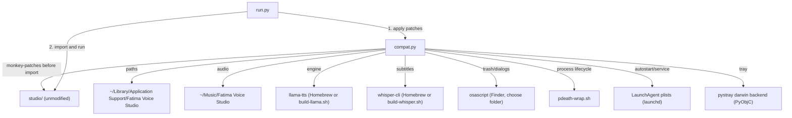

# macOS Port Architecture

Fatima Voice Studio's `studio/` package is Windows-only. This folder adds a compatibility layer so it runs on
Apple Silicon Macs, the same way `linux/` does for Linux — `studio/` is never modified; `macos/compat.py`
monkey-patches it at import time before `studio` is imported (see `run.py`).

## Components

## What `compat.py` replaces

1. **Paths** (`_patch_config`): data in `$FVS_HOME` (default `~/Library/Application Support/Fatima Voice Studio`),
   audio in `~/Music/Fatima Voice Studio`.
2. **Tools** (`_patch_tools`): ffmpeg and whisper-cli come from Homebrew or the local `build-*.sh` fallback; the
   Windows `.exe` downloads are never offered or run.
3. **Hardware** (`_patch_hardware`): CPU/RAM from `sysctl`, battery from `pmset`. Apple Silicon has no separate
   VRAM — the GPU entry reports unified memory (`vram_gb == ram_gb`), so `studio/hardware.py`'s model-fit logic
   (written for a dedicated GPU) still picks Q8 correctly on a Mac with enough RAM.
4. **Trash, folder dialog, open, clipboard** (`_patch_misc`): `osascript` (Finder, `choose folder`), `open`,
   `pbcopy`.
5. **Autostart and `--service`** (`_patch_autostart`, `write_service_plist`): two separate LaunchAgent plists —
   one toggled from the tray ("Start at login"), one installed by `setup.sh --service` with `KeepAlive` for a
   persistent background run (there is no systemd on macOS).
6. **Process lifecycle** (`_patch_engine`): `pdeath-wrap.sh` polls the app's PID and kills the engine once the
   app is gone (macOS has no `pdeathsig`, which is what `linux/compat.py` uses via `setpriv`).
7. **Tray** (`patch_tray`): PyObjC-based `pystray` backend. `studio/__main__.py` already runs the tray loop on
   the main thread with the server in a background thread — exactly what `NSApplication` needs, so `run.py`
   doesn't restructure anything relative to `linux/run.py`.
8. **Wording** (`_patch_web`): visible "Windows" text in `studio/web/app.js` is rewritten on the way out (HTTP
   middleware), the same technique as `linux/compat.py`.

## Why no shared core with `linux/`

See `docs/superpowers/specs/2026-10-10-macos-port-design.md` — the two platforms turned out different enough
(`osascript` vs. `gio`/`zenity`, PyObjC vs. AppIndicator, `launchd` vs. `systemd`) that a shared abstraction
would have been premature. If that changes, extracting a shared core is a deliberate, separate step.
